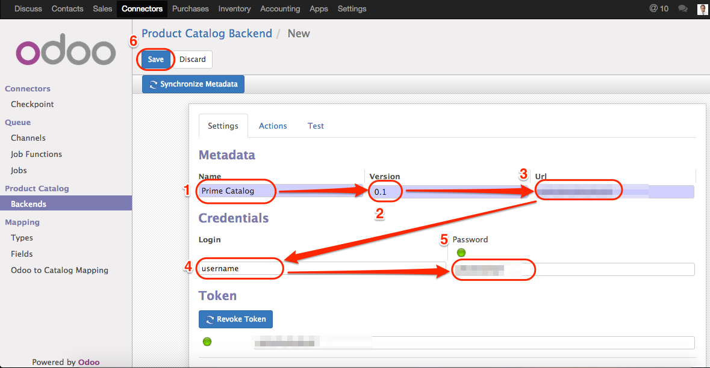
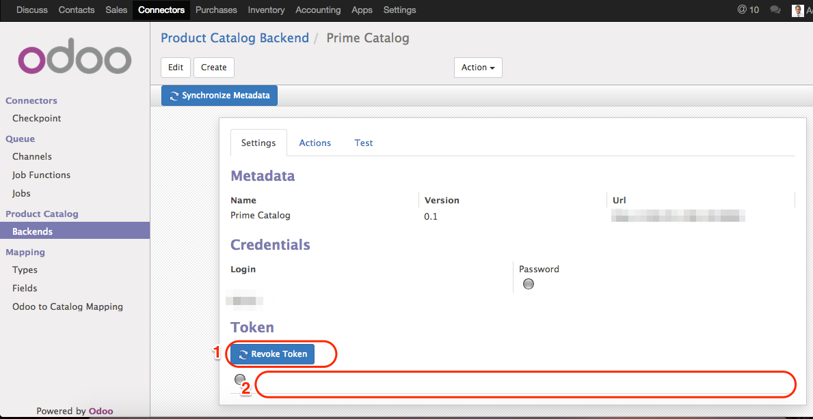
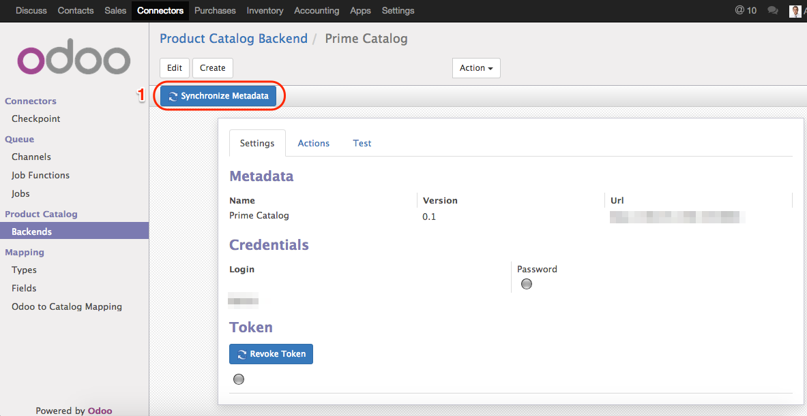

.. image:: https://img.shields.io/badge/licence-AGPL--3-blue.svg
    :alt: License

Prime Catalog Connector
=======================

This is module for integration with **Prime Catalog**

Synchronizations:

Odoo -> Prime Catalog
---------------------
* Product data
* Inventory
* Sales
* Vendors
* Pricing
* Orders

Automatizations:

* Automatic send data to Prime Catalog if any product data changed
* Automatic send data to Prime Catalog if any product qty changed

Technical points:

* Built on top of the `connector`_ framework
* Use the jobs system of the `connector`_ framework
* Licensed under AGPL version 3
* Designed to be usable with multiple Prime backends in the same time.

.. _connector: https://github.com/OCA/connector

Installation
============

* 1.1. Go to `Connectors`
* 1.2. Go to `Prime Catalog / Backends`
* 1.3. Click `Create`

.. figure:: ../prime_catalog_connector/static/description/create_new_backend_1.png
   :scale: 60 %
   :alt: Sample Create New Backend 1st step

* 2.1. Fill any `Name` for your new backend
* 2.2. Change version to `0.1`
* 2.3. Put your `Prime Catalog URL`
* 2.4. Fill your `Username`
* 2.5. Fill your `Password`

* 3.1 Click `Revoke Token`
* 3.2 See that you received new token

* 4.1 Click `Synchronize Metadata` button

Credits
=======

Contributors
------------

See `contributors' list`_

.. _contributors' list: ./AUTHORS

Maintainer
----------

.. image:: http://progforce.com/sites/all/themes/theme549/logo.png
   :alt: ProgForce LLC.
   :target: http://progforce.com

This module is maintained by the ProgForce LLC.

ProgForce LLC is a nonprofit organization
whose mission is to support the collaborative development of Odoo
features and promote its widespread use.

To contribute to this module, please visit http://progforce.com.
